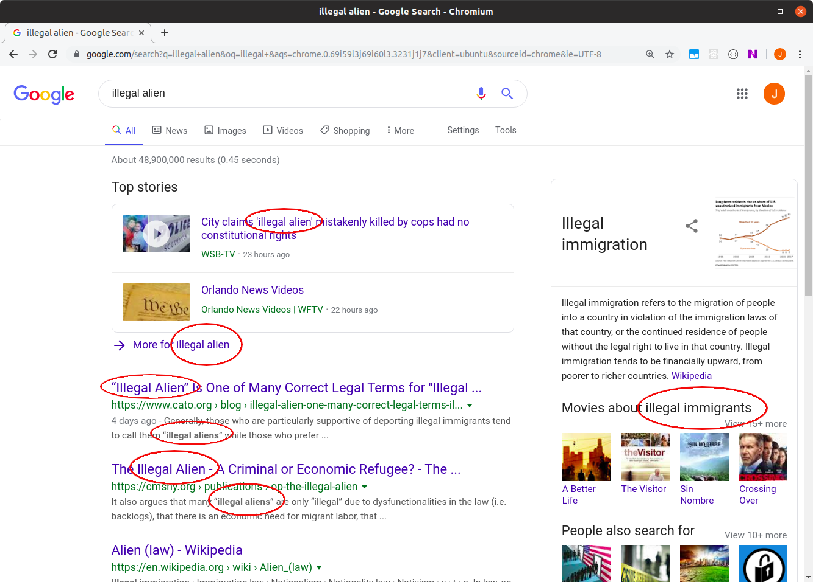
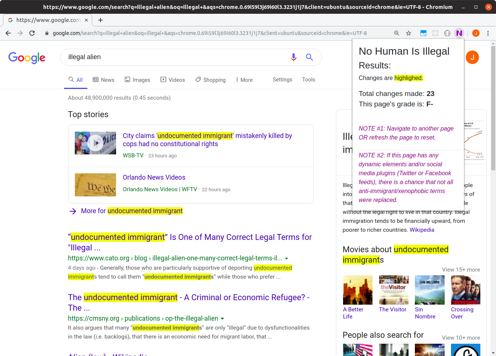
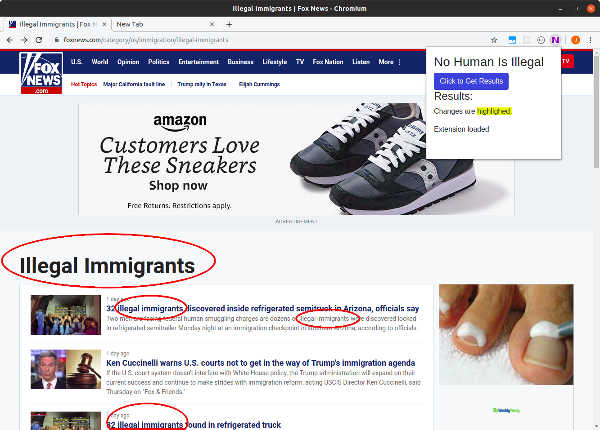
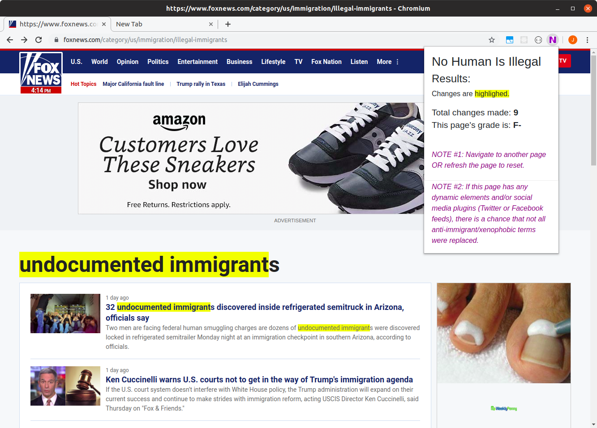

<h2>No Human Being is Illegal on Stolen Land</h2> 

A Chrome extension to replace anti-immigrant and xenophobic phrases and words such as "illegals", "illegal alien", "illegal immigrants", etc... to "undocumented immigrant" because no human being is illegal on stolen land.
 

The extension keeps track of the number of times the anti-immigrant terms are used, highlights the areas where it makes the necessary changes, and provides a letter grading to the site ("A" - "F" scale).

<h4>BEFORE (Google search):</h4>
  
<h4>AFTER (Google search): </h4>

 

<h4>BEFORE (Fox News):</h4>
  
<h4>AFTER (Fox News): </h4>

 

